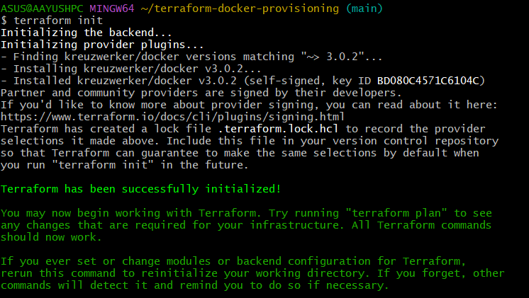
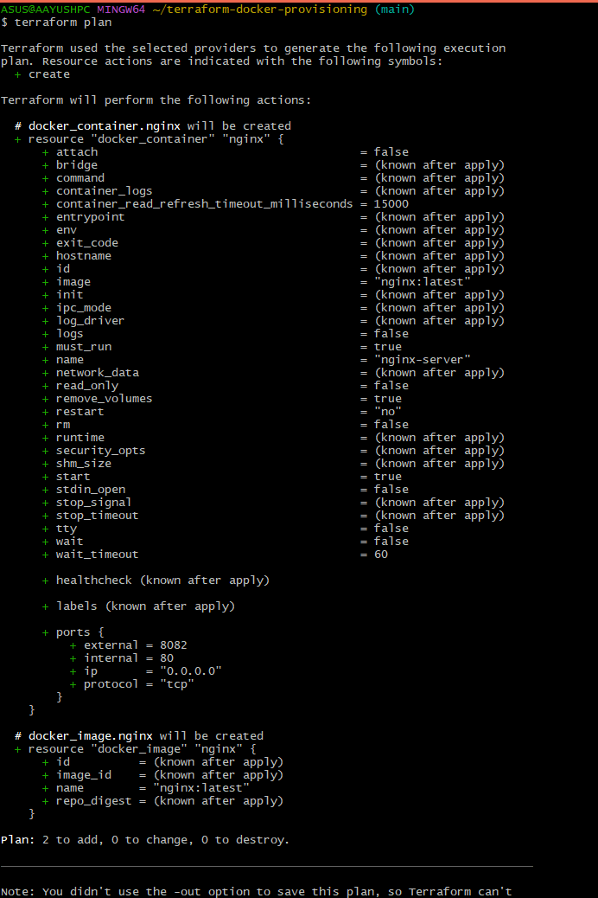
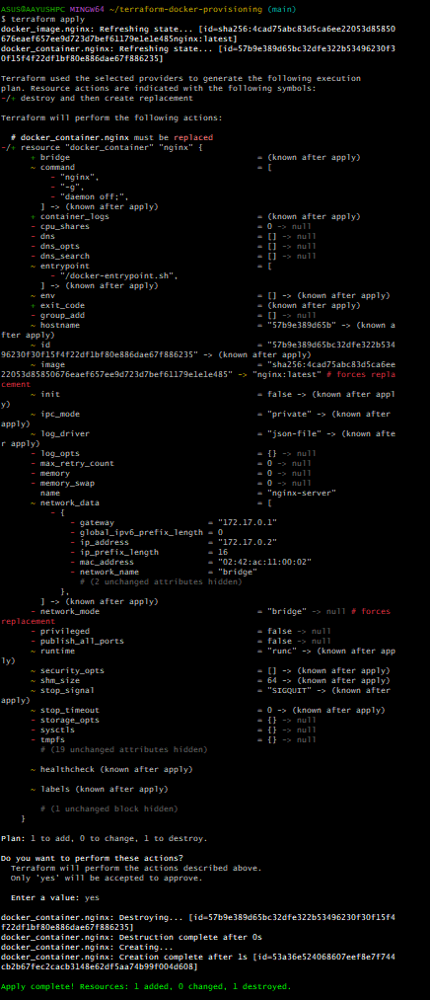
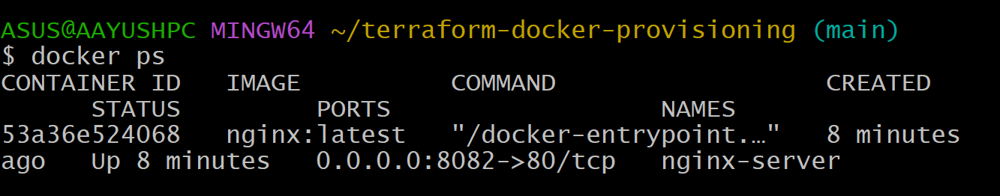
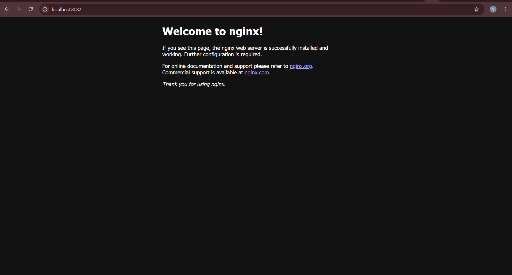
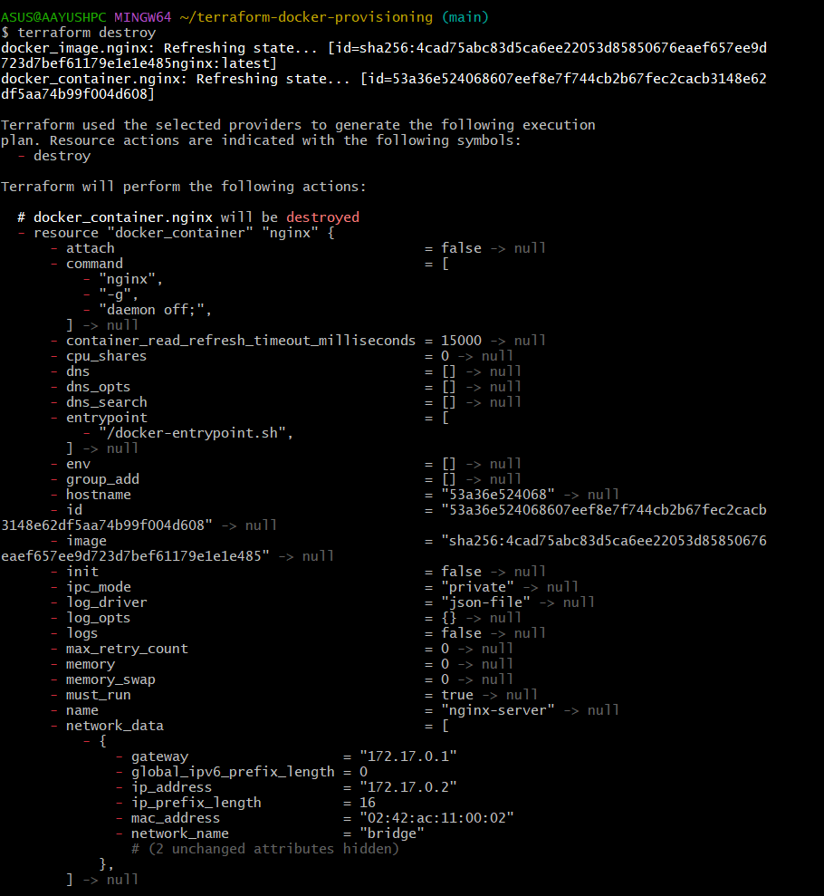

# Terraform Docker Provisioning 🚀

This project demonstrates how to use **Terraform** to provision a local **Docker container** running NGINX.  


---

## 🔧 Tools Used

- 🏗️ **Terraform** – Infrastructure as Code (IaC)
- 🐳 **Docker** – Containerization platform

---

## 📌 What This Project Does

- Uses Terraform to define infrastructure (an NGINX container)
- Pulls the latest NGINX image from Docker Hub
- Provisions a container named `nginx-server`
- Maps local port **8082** to container port **80**
- Exposes the container on: [http://localhost:8082](http://localhost:8082)

---

## 📁 Folder Structure
.
<br>├── main.tf               # Terraform configuration
<br>├── .gitignore            # Ignores .terraform, state files, logs
<br>├── execution-log.txt     # Optional: Terminal logs of Terraform commands
<br>├── screenshots/          # Visual outputs for each Terraform step
<br>└── README.md             # You're reading it!

🚀 How to Run This Project
Clone the repo:
```
git clone https://github.com/YOUR_USERNAME/terraform-docker-provisioning.git
cd terraform-docker-provisioning
```
Initialize Terraform:
```
terraform init
```
Preview the infrastructure:
```
terraform plan
```
Apply to provision:
```
terraform apply
```

Access the app:
Visit → http://localhost:8082

Destroy the infrastructure when done:
```
terraform destroy
```
📸 Screenshots

🔧 Terraform Init


🔍 Terraform Plan


🚀 Terraform Apply


🐳 Docker Container Running


🌐 NGINX Webpage (localhost:8082)


💣 Terraform Destroy


📚 Concepts Covered
✅ Infrastructure as Code with Terraform

✅ Docker provider usage in Terraform

✅ Managing state with terraform.tfstate

✅ Terraform commands: init, plan, apply, destroy

✅ Clean and repeatable local development environments


## ✅ Final Push Command

After replacing your current `README.md` with this version, commit and push everything:
```
git add README.md screenshots/
git commit -m "Updated README with embedded screenshots for Task 3"
git push
```

👨‍💻 Author
Aayush Kukade

---

## 📚 More From My DevOps Series

This project is part of my DevOps learning journey.  
Read the full series here:

🔗 [DevOps Master Blog – My Journey](https://medium.com/@sroy10012001/my-devops-internship-journey-with-elevate-labs-30-days-of-learning-d7252e409a20)

